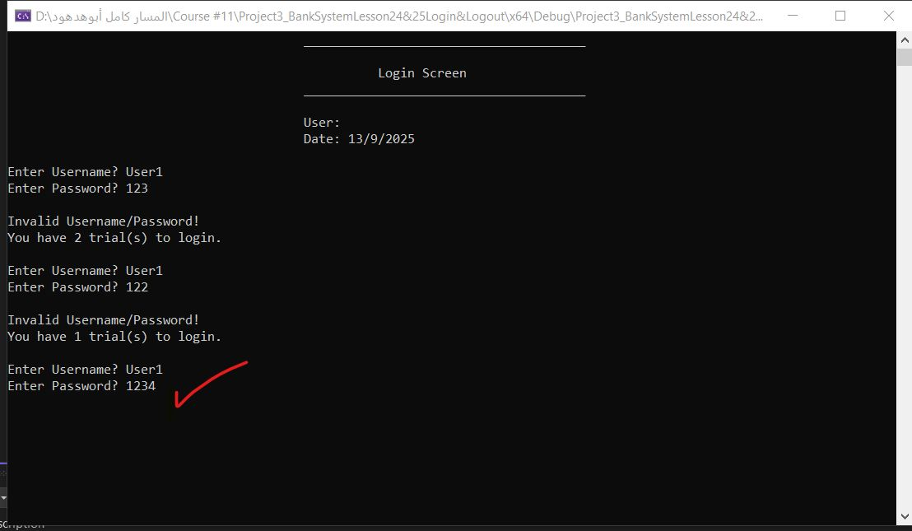
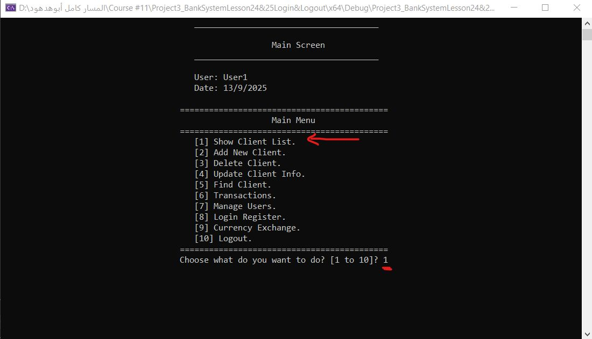
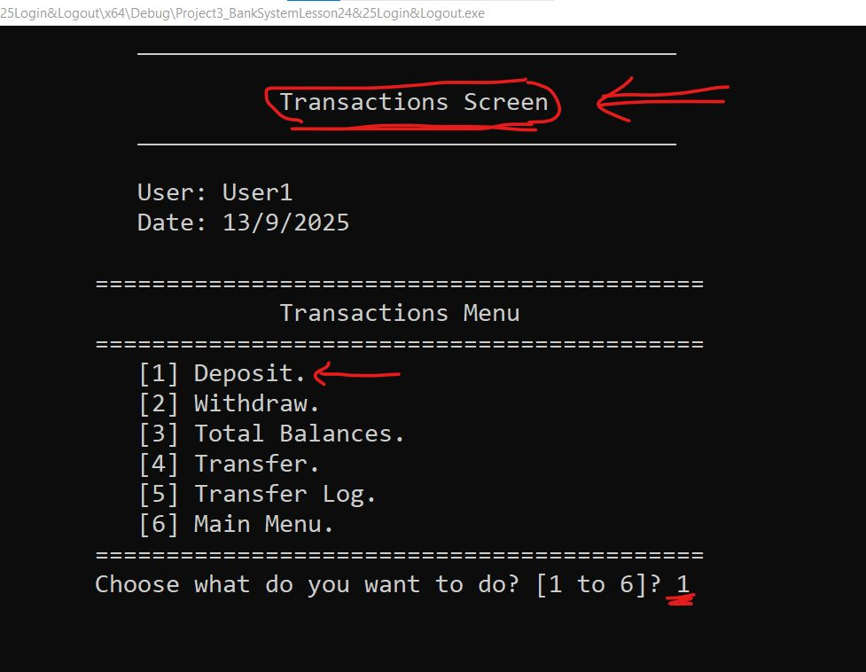
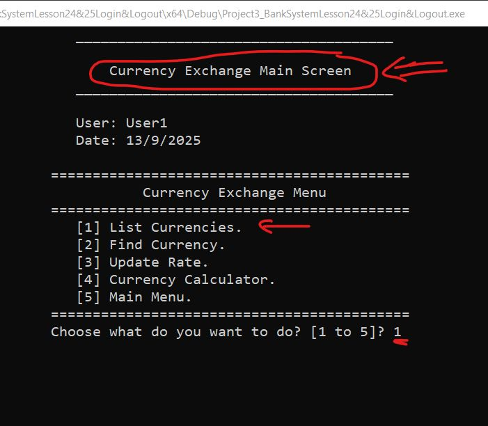

# Object-Oriented Banking System

A console-based Banking Management System developed using Object-Oriented C++.

The project simulates a real-world banking system and includes user and client management, role-based access control (RBAC), banking transactions, currency exchange, and persistent file-based storage.

---

## Features

### Authentication & Authorization

- Secure login system
- Role-Based Access Control (RBAC)
- User management with customizable permissions
- Login history tracking

### Client Management

- Add new clients
- Update client information
- Delete clients
- Find clients
- List all clients

### Banking Transactions

- Deposit
- Withdraw
- Money transfer
- Total balances report
- Transfer logs

### Currency Exchange

- View available currencies
- Search currencies
- Update exchange rates
- Currency calculator

### Persistent Storage

- Store users, clients, currencies, and logs using text files
- Data persists across application runs

---

## Technologies

- C++
- Object-Oriented Programming (OOP)
- File I/O
- Console Applications
- Access Control

---

## OOP Concepts Applied

- Encapsulation
- Inheritance
- Polymorphism
- Composition
- Abstraction
- Separation of Concerns

---

## Screenshots

### Login Screen

---

### Main Menu

---

### Transactions

---

### Currency Exchange

---

## Future Improvements

- Replace file storage with SQL Database
- Develop REST APIs using ASP.NET Core
- Add password hashing
- Create a graphical user interface (GUI)

---

## Author

Ali Waheed Aboul-Seoud

Backend Engineer passionate about Computer Science and building reliable software systems using C++ and C#.

LinkedIn:

https://www.linkedin.com/in/ali-waheed-aboul-seoud-a36399336
